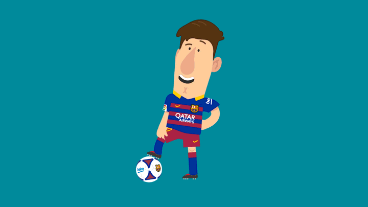

# Building a Competitive National Football Team
## And an Analysis of its Economic Impacts on Rarita

This report discusses the construction of Rarita’s national football team using statistical models and analyses the
impact of a competitive team on the country’s economy. Data cleaning and standardisation was initially conducted
to address data concerns. Several foundational assumptions were established before model fitting for team
selection and projection of key economic indices. Due to the need to monitor the effectiveness of the proposed
team in achieving the established objectives, a flexible implementation plan was established to enable Rarita to
adapt to changing circumstances and subsequently re-select the team. Finally, due to the subjective nature of the
quantitative assumptions used, a sensitivity analysis was conducted to stress test economic feasibility of the team,
before concluding with a discussion of limitations

---

### Congrats on completing the [2022 SOA Research Challenge](https://www.soa.org/research/opportunities/2022-student-research-case-study-challenge/)!

>Now it's time to build your own website to showcase your work.  
>To create a website on GitHub Pages to showcase your work is very easy.

This is written in markdown language. 
>
* Click [4001 link](https://classroom.github.com/a/ggiq0YzO) to accept your group assignment.
* Click [5100 link](https://classroom.github.com/a/uVytCqDv) to accept your group assignment 

#### Follow the [guide doc](Doc1.pdf) to submit your work. 
---
>Be creative! Feel free to link to embed your [data](player_data_salaries_2020.csv), [code](sample-data-clean.ipynb), [image](ACC.png) here

More information on GitHub Pages can be found [here](https://pages.github.com/)

