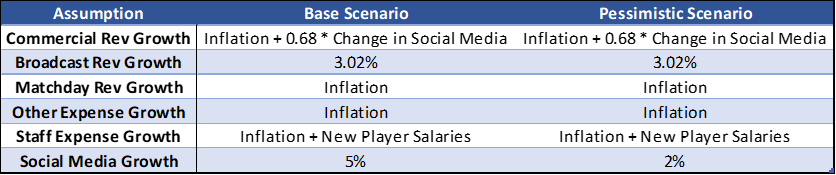
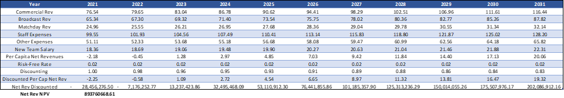

# Building a Competitive National Football Team


## Group Members
* Lenny Han - z5258272
* Thomas Jiang - z5255865
* Zekai (Eric) Kuang - z5256982
* Celina Mak - z5255598

## Table of Contents
<!-- TABLE OF CONTENTS -->
<details open>
  <summary style = "font-size:13pt;">Table of Contents</summary>
  <ol>
    <li>
      <a href="#overview">Overview</a>
    </li>
    <li>
      <a href="#project-objectives">Project Objectives</a>
    </li>
    <li>
      <a href="#data-cleaning">Data Cleaning</a>
    </li>
    <li>
      <a href="#assumptions">Assumptions</a>
      <ol>
        <li><a href="#team-selection">Team Selection</a></li>
        <li><a href="#economic-impact">Economic Impact</a></li>
      </ol>
    </li>
    <li>
      <a href="#team-selection-methodology">Team Selection Methodology</a>
      <ol>
        <li><a href="#feature-selection">Feature Selection</a></li>
        <li><a href="#player-metric">Player Metric</a></li>
        <li><a href="#comparison-against-competitors">Comparison Against Competitors</a></li>
        <li><a href="#national-football-team-selected">National Football Team Selected</a></li>
        <li><a href="#implementation-plan">Implementation Plan</a></li>
      </ol>
     </li>
    <li>
      <a href="#economic-impacts">Economic Impacts</a>
      <ol>
        <li><a href="#gdp-projections">GDP Projections</a></li>
        <li><a href="#net-revenue-projections">Net Revenue Projections</a></li>
        <li><a href="#sensitivity-analysis">Sensitivity Analysis</a></li>
      </ol>
    </li>
    <li>
      <a href="#risks-and-limitations">Risks and Limitations</a>
    </li>
    <li>
      <a href="#conclusion">Conclusion</a>
    </li>
  </ol>
</details>

## Overview

This landing page showcases the methodology behind the construction of Rarita’s national football team using statistical models and analyses the
impact of a competitive team on the country’s economy. Here, we outline several key considerations in our team selection including data cleaning, assumptions, methodology, economic impacts and risks and limitations. 

## Project Objectives 

The objectives of this project included: 
* Ranking within Football and Sporting Association’s (FSA) top ten members within the next five years and,
* Having a high probability of winning an FSA championship within the next ten years.

By developing Rarita’s national football brand, the overarching objective was to achieve positive economic impacts
for the country over the next 10 years such as GDP growth.

## Data Cleaning

R was used to firstly clean/standardise the raw datasets. 

> League defending, passing, shooting, salary, and goalkeeping statistics were imported from the case data in Excel: [2022-student-research-case-study-player-data.xlsx](https://github.com/ACTL4001-T1-2022/github-showcase-page-abc123/files/8442757/2022-student-research-case-study-player-data.xlsx)

```
#Load packages
install.packages("tidyverse")
library(tidyverse)

#Load data
ld <- read.csv("ld.csv",header=T,stringsAsFactors=T)
lg <- read.csv("lg.csv",header=T,stringsAsFactors=T)
lp <- read.csv("lp.csv",header=T,stringsAsFactors=T)
ls <- read.csv("ls.csv",header=T,stringsAsFactors=T)

sal20 <- read.csv("sal20.csv",header=T,stringsAsFactors = T)
sal21 <- read.csv("sal21.csv",header=T,stringsAsFactors = T)

#Remove duplicated data points
sal20 <- sal20[!duplicated(sal20),]
sal21 <- sal21[!duplicated(sal21),]
```

> The data was separated by the associated year (2020 and 2021).

```
ld20 <- ld %>% filter(Year==2020)
lg20 <- lg %>% filter(Year==2020)
lp20 <- lp %>% filter(Year==2020)
ls20 <- ls %>% filter(Year==2020)

ld21 <- ld %>% filter(Year==2021)
lg21 <- lg %>% filter(Year==2021)
lp21 <- lp %>% filter(Year==2021)
ls21 <- ls %>% filter(Year==2021)
```

> Defending, shooting, passing, and salary data were then joined to create a single dataset. Goalkeeping data was separated due to the different set of measured statistics.

```
ldp20 <- left_join(ld20,lp20,by=c("Player","Nation","Pos","Squad","League","Year"))
ldps20 <- left_join(ldp20,ls20,by=c("Player","Nation","Pos","Squad","League","Year"))
ldpss20 <- left_join(ldps20,sal20,by=c("Player"))
lgs20 <- left_join(lg20,sal20,by=c("Player"))

ldp21 <- left_join(ld21,lp21,by=c("Player","Nation","Pos","Squad","League","Year"))
ldps21 <- left_join(ldp21,ls21,by=c("Player","Nation","Pos","Squad","League","Year"))
ldpss21 <- left_join(ldps21,sal21,by=c("Player"))
lgs21 <- left_join(lg21,sal21,by=c("Player"))
```

> N/A and negative data were set to equal 0 to avoid data issues in later modelling steps.

```
ldpss <- union_all(ldpss20, ldpss21)
ldpss[is.na(ldpss)] <- 0
ldpss[is.negative(ldpss)] <- 0
```

## Assumptions
### Team Selection

| Factor | Assumption |
| :---:  | :---:  |
| Salary        | Player salaries were used as a proxy for their overall ability, with more skilled players being paid higher salaries.  |
| Salary Growth  | In line with Rarita's inflation rates. |
| Inflation Rates  | Projected using a moving average of inflation rates from the preceding 5 years.  |
| Tournament Performance  | Tournament performance is positively correlated with economic impact. |
| Loan Provisions  | The loan fee is charged recurringly on an annual basis.  |

### Economic Impact

| Factor  | Assumption |
| :---:  | :---:  |
| Inflation        | Projected from 2021-31 using a 5-year moving average with projected rates of 2.5-3% over the period, which is in-line with Rarita's historical inflation trends. |
| Discount Rate | Set as 1.9%, the 10-year treasury yield as of 2021 for Rarita. |
| Commercial Revenue  | A mix of inflation and social media growth was used to project commercial revenue.|
| Broadcast Revenue  | Average annual growth over 2016-19 was used to estimate long-term growth. |
| Staff Expenses  | Estimated using existing per capital staff expenses and salary of constructed team. Projected under best-estimate of inflation for future periods.  |
| Matchday Revenue and Other Expenses | Projected using estimated inflation.  |
| Social Media Growth | Best estimate of 5% annual growth rate using baseline scenario of Rarita's tournament performance. |
| GDP Growth | Baseline economic scenario projected using linear regression model on Healthcare Spending, Savings Rate and Population Density. |

## Team Selection Methodology

### Feature Selection
A random forest model was developed to predict the salaries of players using their measured statistics to identify high performing players and select the most competitive team for Rarita.

```
library(gbm)
library(randomForest)

ball <- read.csv('ldpssmerged.csv', header = TRUE)
```

> Age and league treated as factors in model.

```
ball$Player <- NULL
ball$Age <- as.factor(ball$Age)
ball$League <- as.factor(ball$League)

ball[is.na(ball)] <- 0

ball_gk <- ball %>% filter(str_detect(ball$Pos, "GK"))
```

> Dataset portioned into training and test set with an 80:20 split.

```
set.seed(1)
training_set <- sample(length(ball$Salary), 0.8*length(ball$Salary))
train <- ball[training_set, ]
test <- ball[-training_set, ]
```

> Random Forest model for forwards, midfielders, and defenders fit using training and testing sets.

```
#Model fitting on training set
p <- length(ball) - 1     #Number of predictors in the data set
m <- round(sqrt(p))
rf_fit <- randomForest(as.numeric(Salary) ~ ., data = train, mtry = m, importance = TRUE)
varImpPlot(rf_fit)

#Re-run random forest model after selecting most important variables
rf_fit1 <- randomForest(as.numeric(Salary) ~ League + Pressures.Def.3rd + Pressures.Mid.3rd + Pressures.Att.3rd + Int + Clr + Long.Att + KP + Standard.Sh.90 + Standard.SoT.90 + Expected.npxG, data = train, mtry = m, importance = TRUE)
varImpPlot(rf_fit1)

#Model fitting on testing set
p <- length(train) - 1     #Number of predictors in the data set
m <- round(sqrt(p))
rf_fit_test <- randomForest(as.numeric(Salary) ~ ., data = test, mtry = m, importance = TRUE)

#Re-run random forest model after selecting most important variables
rf_fit1_test <- randomForest(as.numeric(Salary) ~ League + Pressures.Def.3rd + Pressures.Mid.3rd + Pressures.Att.3rd + Int + Clr + Long.Att + KP + Standard.Sh.90 + Standard.SoT.90 + Expected.npxG, data = test, mtry = m, importance = TRUE)
varImpPlot(rf_fit1_test)
```

> A separate random forest model was fit for goalkeepers due to varying measured statistics.

```
p_gk <- length(ball_gk) - 1     #Number of predictors in the data set
m_gk <- round(sqrt(p_gk))
rf_fit_gk <- randomForest(as.numeric(Salary) ~ ., data = ball_gk, mtry = m_gk, importance = TRUE, na.action = na.roughfix)
varImpPlot(rf_fit_gk)
```

> GBM was also fit, with results compared to Random Forest.

```
#For forwards, midfielders and defenders
b_fit <- gbm(Salary ~ ., data = train, distribution = 'gaussian', n.trees = 5000, interaction.depth = 3, shrinkage = 0.01, cv.folds = 10)
b_prob <- predict(b_fit, newdata= test, n.trees = which.min(b_fit$cv.error))
b_comparison <- abs(b_prob - as.numeric(test$Salary))

#For goalkeepers
b_fit_gk <- gbm(Salary ~ ., data = ball_gk, distribution = 'gaussian', n.trees = 5000, interaction.depth = 3, shrinkage = 0.01, cv.folds = 10)
b_prob_gk <- predict(b_fit_gk, newdata= ball_gk, n.trees = which.min(b_fit$cv.error))
b_comparison_gk <- abs(b_prob_gk - as.numeric(test$Salary))
```

It was found that Random Forest performed similarly to GBM, whereby due to the potential for GBMs to overfit, the Random Forest model was chosen for feature selection in identifying top performing players. This model fitting process was repeated by excluding the least important and unstandardised variables (such as aggregated statistics rather than per 90-minute statistics) to prevent overfitting and collinearity amongst predictors.

The most significant predictors were determined by setting a lower bound for its contribution to percentage of variance explained, predictors below this threshold were removed. This ultimately led us to a Random Forest model that only included the most significant predictors of player salary, which were then used to build our player metric. 

### Player Metric


Based on the variable importance results above, the following player statistics were chosen for forwards, midfielders, and defenders:

| Statistic | Definition| Variable Importance Weighting|
| :---:  | :---:|:---:|
| Expected.npxG | Non-penalty expected goals| 0.1729|
| Standard.Sh.90 |Shots total per 90 minutes|0.1378|
| KP | Passes leading to a shot|0.1155|
|Long.Att| Passes >30 yards attempted|0.0755|
|Int| Interceptions|0.1015|
|Pressures.Def.3rd| Pressure applied to opponent in the defensive 1/3|0.0533|
|Standard.SoT.90| Shots on target per 90 minutes|0.0937|
|Pressures.Att.3rd| Pressure applied to opponent in the attacking 1/3|0.1065|
|Clr| Clearances|0.0719|
|Pressures.Mid.3rd|Pressure applied to opponent in the middle 1/3|0.0714|

A weighted average of the selected statistics was the final metric used to evaluate the players. The weights were formulated as a proportion of their respective variance importance figures in the random forest model. For players exhibiting similar metric figures, the cheaper player was chosen as they provided more "value" on a per dollar basis. The National Football Team selected can be viewed below.

### Comparison Against Competitors

An equivalent team metric was calculated for the selected team as well as the top-10 nations in the 2021 Tournament. 


Higher ranking teams typically exhibited larger metric scores, confirming the metric's validity and accuracy in evaluating player and overall team performance. The selected team produced an average metric of 1.271 with a standard deviation of 0.323. Using a normal approximation, this yielded a lower bound of 0.638 for a 95% confidence interval, and a lower bound of 0.441 for a 99% confidence interval. In comparison to the participating nations in the 2021 Tournament, the selected team yielded a 95.818% and a 9.510% probability of a top-5 and first-place finish respectively. Althought the chosen metric may not accurately project the future performance of all teams, the probability measures strongly suggests Rarita's team can consistently outperform the tournament participants based on their 2021 Tournament performance. Thus, the "competitive" criteria of the objective can be satisfied.

### National Football Team Selected

| Player | Nation |
| :---:  | :---:  |
| Y. Rabinovitch | Western Niasland |
| G. Katumba | Biarizea |
| M. Nkhata | People's Land of Maneau |
| M. Rashid | Sobianitedrucy |
| C. Kakayi | Dosqaly |
| S. Rizzo | Sobianitedrucy |
| X. Takagi | Rarita |
| V. It | Mico |
| O. Nakisige | Reugha |
| A. Fekete | Byasier Pujan |
| M. Kabiru | Sobianitedrucy |
| F. Among | Biarizea |
| D. Makumbi | Rarita |
| K. Mawanda | Varijitri Isles |
| P. Anderson | Esia |
| J. Yeo | Dosqaly |
| I. Tabu | Rarita |
| K. Kazlo | Rarita |
| Z. Nyamahunge | Rarita |
| F. Ithungu | Rarita |

### Implementation Plan

An implementation plan was created to facilitate ongoing monitoring and respond quickly to changing circumstances
and emerging risks which will ensure a competitive football team. This was created as an annual framework to
monitor progress over the next 10 years, as illustrated below. 


The constructed implementation timeline has regular monitoring efforts and flexibility to adapt to changing
circumstances that could otherwise lead to adverse effects for the team. 

## Economic Impacts 

### GDP Projections

### Net Revenue Projections and Expected NPV





### Sensitivity Analysis 


## Risks and Limitations

Through continual monitoring efforts as shown in our implementation timeline, key risks can be mitigated. 
These key risks include Rarita’s national team becoming uncompetitive, growth of competitors’ abilities, increased prices to loan players from external countries and inaccurate projections.

Furthermore, political risks can have negative implications on Rarita’s national team. The most notable
consequence would be the prohibition of loaning external players which could reduce the competitiveness of
Rarita’s team. However, the metric system designed would allow Rarita to quickly identify appropriate substitute
players with constant monitoring to review the team’s performance.

In addition to risks, key limitations were also considered which are detailed in the table below. 

| Limitation | Implication |
| :---: | :---: |
| Generating revenue by loaning Raritan players not included in net revenue | Revenues are understated but best estimates show they are sufficient |
| Only salaries of new players on national teams and inflation considered in expense projections | Currently no consideration for potential fixed costs (e.g. investment in infrastructure). These expenses must be included separately in the future if required | 
| Team construction dependent on player data and metrics of competing teams, all of which only available for past periods | Opposing teams may improve significantly compared to previous years, which may our benchmarks for teambuilding irrelevant |
| Players are selected based on league statistics, so only players present in league dataset are considered in team selection | Some teams had a large number of players not present in league data and their team is unable to be evaluated by our metric. We also did not allow selection of non-league players in our team construction | 

## Conclusion

In conclusion, a competitive national team was constructed for Rarita using a metric developed from chosen
statistics. The key objectives of achieving competitiveness were successfully met as Rarita’s national team is projected to continue improving and
adapting to the future competition environment, espeically through the development of our player metric and continual monitoring. Overall, Rarita’s national team will build a brand for the country’s football program and achieve positive economic impacts for the country.


